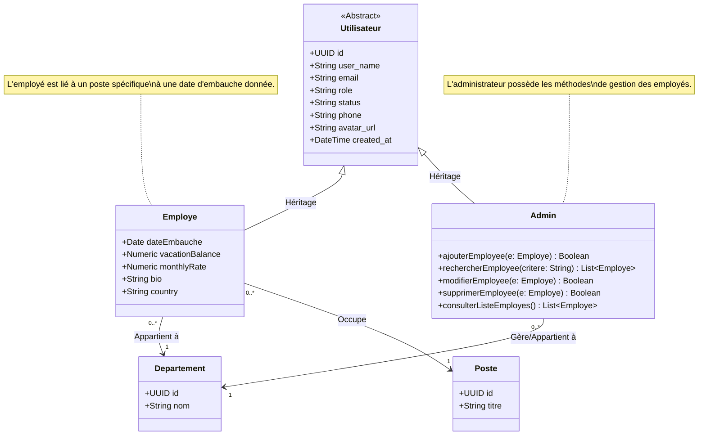

# Diagramme de Classe - Système de Gestion des Employés

Ce diagramme représente la structure logique des classes pour la gestion des utilisateurs, employés et administrateurs.

## Description des Classes

### 1. Utilisateur (Classe de base)
Contient les informations communes à tous les comptes du système (nom, email, rôle, status, etc.). Elle sert de socle pour l'authentification et l'identification unique.

### 2. Employe
Spécialisation de l'utilisateur. Il possède des attributs spécifiques à son contrat de travail comme la `dateEmbauche`, le `vacationBalance` et son `monthlyRate`. Il est obligatoirement lié à un **Poste** et un **Departement**.

### 3. Admin
Spécialisation de l'utilisateur avec des privilèges élevés. Il est responsable des opérations CRUD sur les employés :
- **ajouterEmployee** : Permet de créer un nouveau profil employé et son compte utilisateur associé.
- **rechercherEmployee** : Permet de trouver un employé selon certains critères.
- **modifierEmployee** : Permet de mettre à jour les informations d'un employé.
- **supprimerEmployee** : Permet de retirer un employé du système.
- **consulterListeEmployes** : Permet d'afficher la liste complète des employés.

### 4. Departement
Représente les entités organisationnelles de l'entreprise (ex: IT, Sales, Marketing).

### 5. Poste
Définit la fonction occupée par l'employé au sein de l'entreprise (ex: Développeur, Manager, Commercial).
