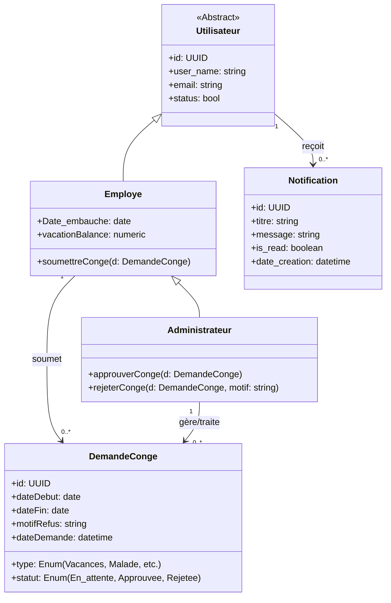
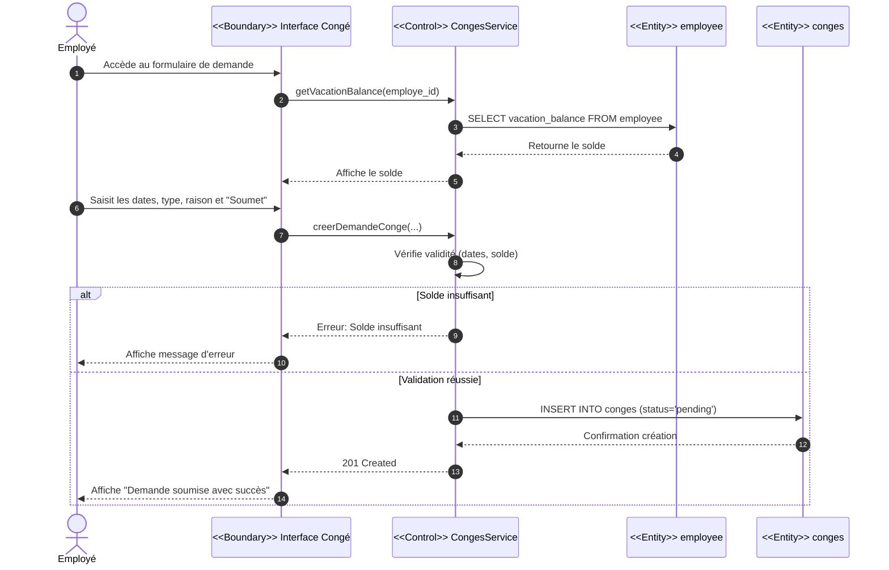
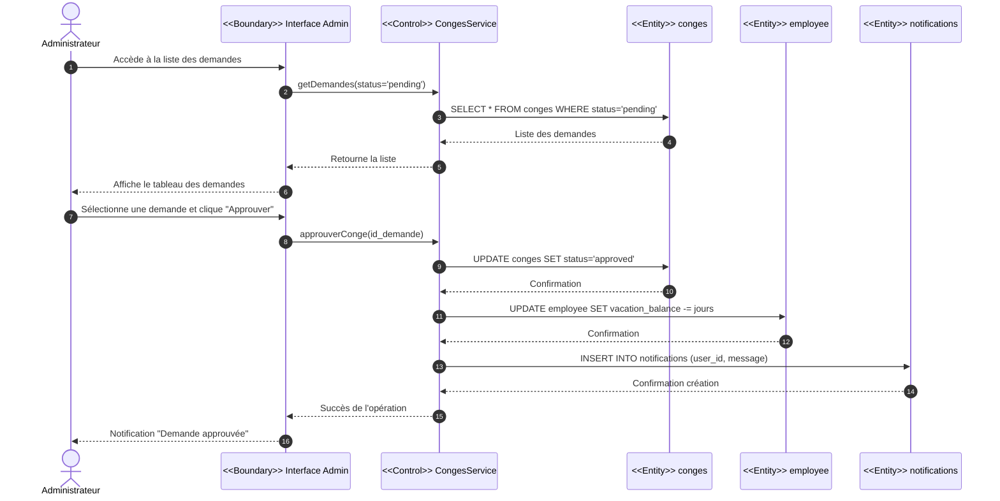
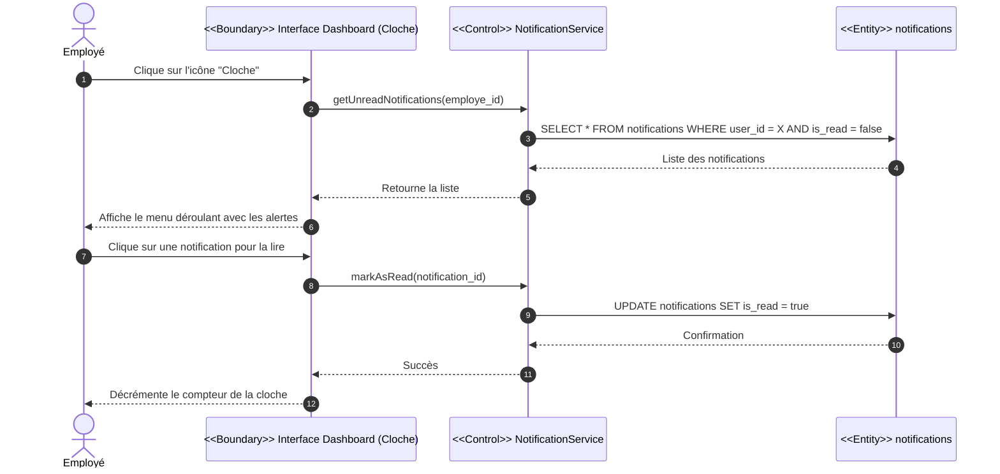

# Étude et réalisation du Sprint 2 : Gestion des Absences (Congés)

Dans cette section, nous présentons la conception UML dédiée aux fonctionnalités du Sprint 2. L'objectif est de modéliser le flux interne de gestion des congés, permettant aux employés de soumettre des demandes et aux administrateurs de les valider ou de les rejeter.

---

## 1. Diagramme des Cas d'Utilisation

Ce diagramme illustre les interactions possibles entre les acteurs (Employé et Administrateur) et le système concernant le module des congés.

```mermaid
usecaseDiagram
    actor "Employé" as emp
    actor "Administrateur" as admin

    package "Gestion des Congés" {
        usecase "Consulter les soldes de congés" as UC1
        usecase "Soumettre une demande de congé" as UC2
        usecase "Gérer les demandes de congés" as UC3
        usecase "Approuver une demande" as UC4
        usecase "Rejeter une demande" as UC5
        usecase "Consulter les notifications" as UC6
    }

    %% Relations Acteurs -> Cas d'utilisation
    emp --> UC1
    emp --> UC2
    emp --> UC6
    
    %% L'Admin hérite des droits de l'employé (il peut donc demander des congés)
    admin --|> emp

    %% Relations de l'Admin
    admin --> UC3

    %% Relations d'inclusion / extension
    UC2 ..> UC1 : <<include>>
    UC4 ..> UC3 : <<extend>>
    UC5 ..> UC3 : <<extend>>
```

**Description des Cas d'Utilisation :**
- **Soumettre une demande de congé :** L'employé remplit un formulaire précisant la période et le type de congé. Cette action inclut automatiquement la consultation de son solde pour vérifier s'il a suffisamment de jours disponibles (notamment pour les congés annuels).
- **Gérer les demandes :** L'administrateur RH consulte la liste des demandes en attente. Il peut étendre cette action soit en approuvant la demande (déclenche la mise à jour du solde de l'employé), soit en la rejetant (en justifiant le motif).

---

## 2. Diagramme de Classes (Sprint 2)

Nous avons enrichi le diagramme de classes du socle initial (Sprint 1) en y intégrant la gestion des congés. Une nouvelle classe `DemandeConge` a été créée.



**Justification de la conception :**
- La classe `DemandeConge` centralise toutes les informations relatives à une demande. Le champ `statut` permet de suivre le cycle de vie de la demande.
- Le champ `motifRefus` garantit la traçabilité en cas de rejet par l'administrateur.
- L'héritage en cascade (`Administrateur` hérite d'`Employe`) permet à l'administrateur de posséder son propre solde de congés (`vacationBalance`) et d'avoir la capacité technique de soumettre des congés, tout en disposant de méthodes exclusives de gestion (`approuverConge`, `rejeterConge`).

---

## 3. Diagrammes de Séquences

Afin de détailler la dynamique du système, nous avons modélisé les scénarios nominaux pour la soumission et le traitement d'une demande.

### 3.1. Scénario : Soumettre une demande de congé

**Diagramme de séquence détaillé du cas d'utilisation « Soumettre une demande de congé »**

Pour la soumission d'une demande de congé, l'employé commence par accéder à l'interface dédiée (Interface Congé). Le système interroge d'abord la base de données (table `employee`) via le service de contrôle pour récupérer et afficher le solde de congés actuel de l'employé. Ensuite, l'employé saisit les détails de sa demande (date debut ,date fin , type de congé, motif) et valide le formulaire. Ces informations sont transmises au service pour vérification. Si le solde est insuffisant par rapport à la durée demandée, le système interrompt le processus et renvoie un message d'erreur. Si la vérification est réussie, le processus continue : la demande est insérée dans la base de données (table `conges`) avec le statut « En attente » (pending), et un message de confirmation est affiché à l'employé.



### 3.2. Scénario : Gérer une demande de congé (Approbation)

**Diagramme de séquence détaillé du cas d'utilisation « Gérer une demande de congé »**

Pour le traitement des demandes de congé, l'administrateur RH accède à l'interface de gestion (Interface Admin). Le système récupère automatiquement depuis la base de données (table `conges`) toutes les demandes ayant le statut « En attente » (pending) et les affiche sous forme de tableau. L'administrateur sélectionne ensuite une demande spécifique et décide de l'approuver. Le système met alors à jour le statut de la demande à « Approuvé » (approved) dans la base de données. Simultanément, une déduction est appliquée sur le solde de congés de l'employé (table `employee`) et une notification In-App est générée dans la table `notifications` pour alerter l'employé. Une fois ces opérations enregistrées avec succès en base de données, une notification de confirmation est affichée à l'administrateur pour clôturer le processus.



### 3.3. Scénario : Consulter les notifications In-App

**Diagramme de séquence détaillé du cas d'utilisation « Consulter les notifications »**

Pour être tenu au courant de l'état de ses demandes, l'employé clique sur l'icône de cloche (Alerte) située en haut de son interface. Le système interroge immédiatement la table `notifications` pour récupérer tous les messages non lus associés à cet utilisateur. Une fois la liste retournée et affichée dans un menu déroulant, l'employé clique sur une notification pour la lire. Le système déclenche alors une mise à jour en base de données pour marquer cette notification comme lue (`is_read = true`), afin qu'elle disparaisse du compteur des nouvelles alertes.


