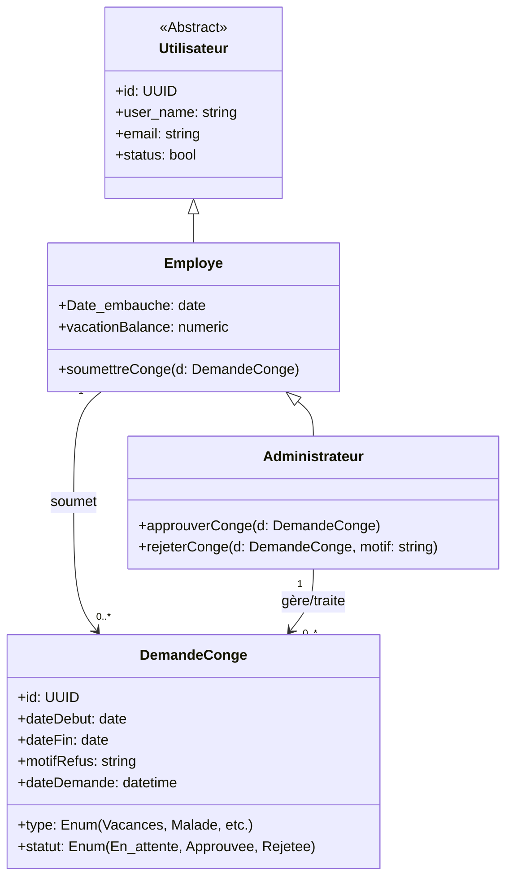
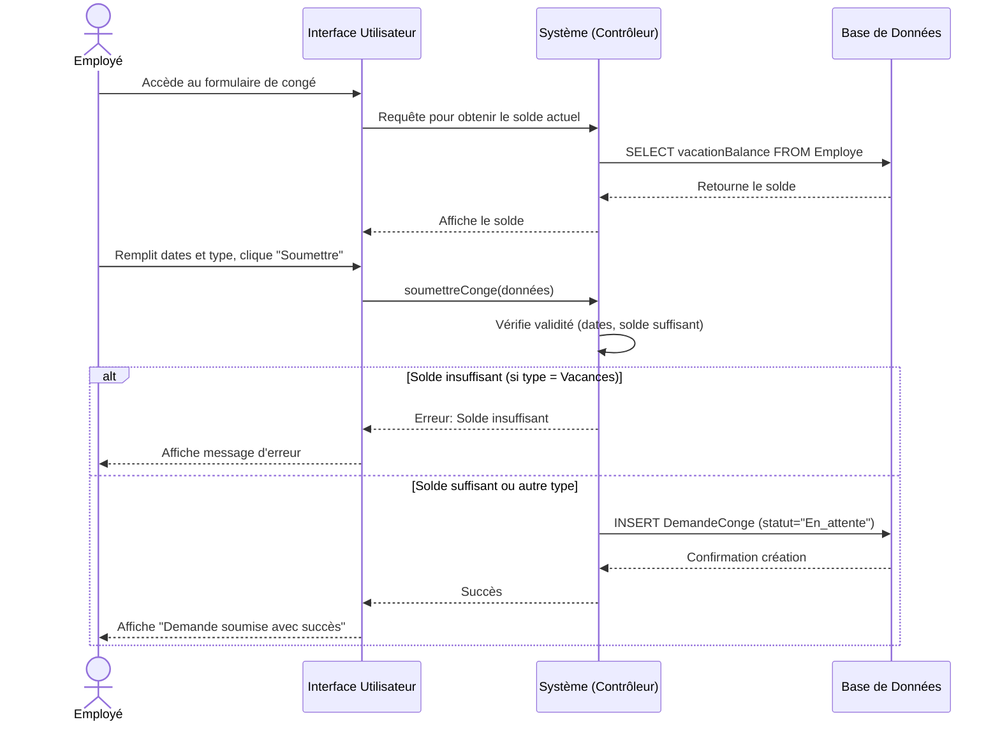
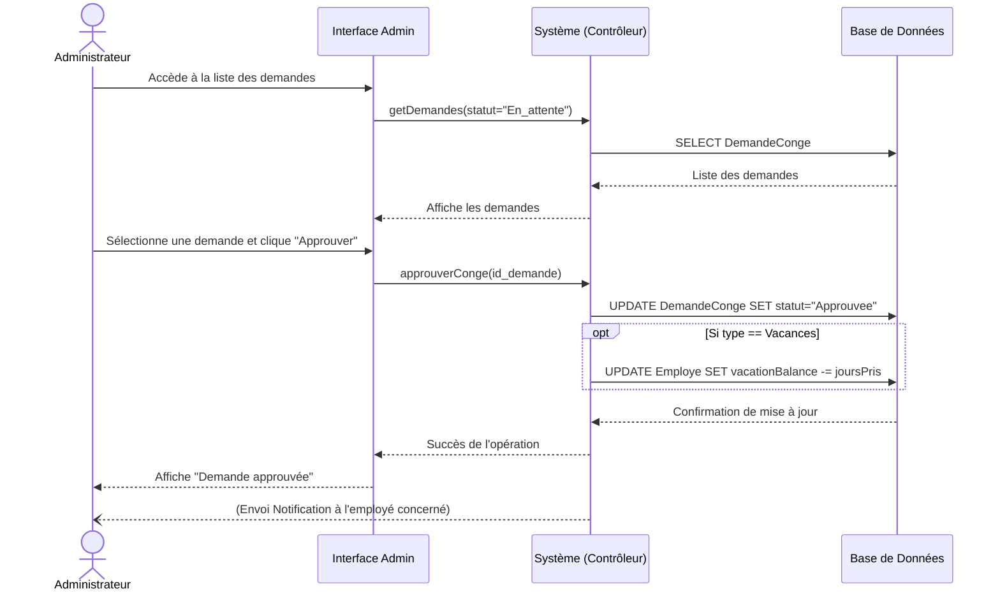

# Étude et réalisation du Sprint 2 : Gestion des Absences (Congés)

Dans cette section, nous présentons la conception UML dédiée aux fonctionnalités du Sprint 2. L'objectif est de modéliser le flux interne de gestion des congés, permettant aux employés de soumettre des demandes et aux administrateurs de les valider ou de les rejeter.

---

## 1. Diagramme des Cas d'Utilisation

Ce diagramme illustre les interactions possibles entre les acteurs (Employé et Administrateur) et le système concernant le module des congés.

```mermaid
usecaseDiagram
    actor "Employé" as emp
    actor "Administrateur" as admin

    package "Gestion des Congés" {
        usecase "Consulter les soldes de congés" as UC1
        usecase "Soumettre une demande de congé" as UC2
        usecase "Gérer les demandes de congés" as UC3
        usecase "Approuver une demande" as UC4
        usecase "Rejeter une demande" as UC5
    }

    %% Relations Acteurs -> Cas d'utilisation
    emp --> UC1
    emp --> UC2
    
    %% L'Admin hérite des droits de l'employé (il peut donc demander des congés)
    admin --|> emp

    %% Relations de l'Admin
    admin --> UC3

    %% Relations d'inclusion / extension
    UC2 ..> UC1 : <<include>>
    UC4 ..> UC3 : <<extend>>
    UC5 ..> UC3 : <<extend>>
```

**Description des Cas d'Utilisation :**
- **Soumettre une demande de congé :** L'employé remplit un formulaire précisant la période et le type de congé. Cette action inclut automatiquement la consultation de son solde pour vérifier s'il a suffisamment de jours disponibles (notamment pour les congés annuels).
- **Gérer les demandes :** L'administrateur RH consulte la liste des demandes en attente. Il peut étendre cette action soit en approuvant la demande (déclenche la mise à jour du solde de l'employé), soit en la rejetant (en justifiant le motif).

---

## 2. Diagramme de Classes (Sprint 2)

Nous avons enrichi le diagramme de classes du socle initial (Sprint 1) en y intégrant la gestion des congés. Une nouvelle classe `DemandeConge` a été créée.



**Justification de la conception :**
- La classe `DemandeConge` centralise toutes les informations relatives à une demande. Le champ `statut` permet de suivre le cycle de vie de la demande.
- Le champ `motifRefus` garantit la traçabilité en cas de rejet par l'administrateur.
- L'héritage en cascade (`Administrateur` hérite d'`Employe`) permet à l'administrateur de posséder son propre solde de congés (`vacationBalance`) et d'avoir la capacité technique de soumettre des congés, tout en disposant de méthodes exclusives de gestion (`approuverConge`, `rejeterConge`).

---

## 3. Diagrammes de Séquences

Afin de détailler la dynamique du système, nous avons modélisé les scénarios nominaux pour la soumission et le traitement d'une demande.

### 3.1. Scénario : Soumettre une demande de congé

Ce diagramme montre comment le système vérifie le solde avant d'enregistrer une nouvelle demande.



### 3.2. Scénario : Gérer une demande de congé (Approbation)

Ce diagramme illustre le processus de traitement par l'administrateur.


