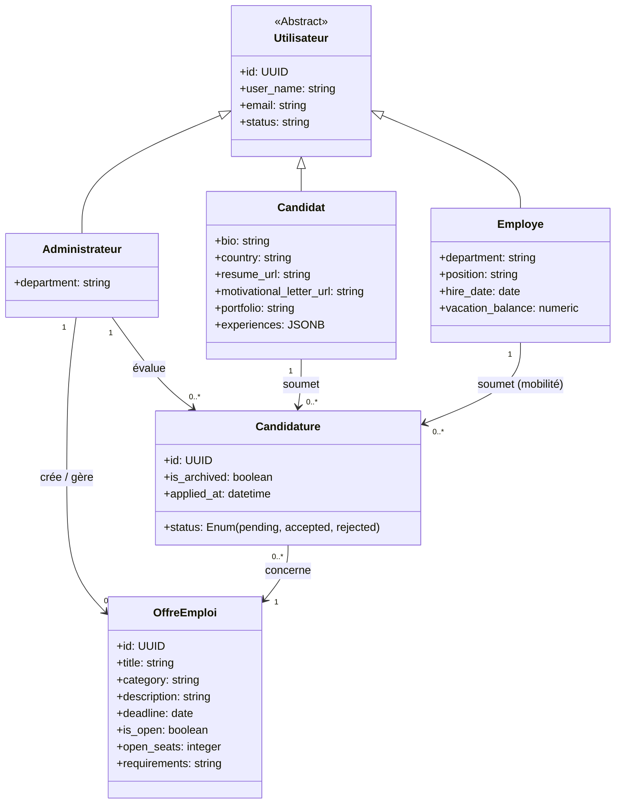
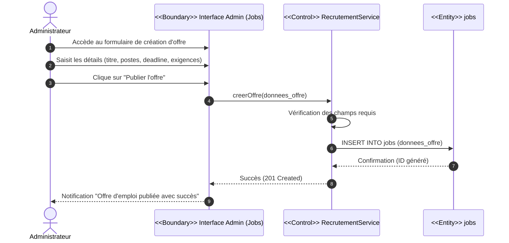
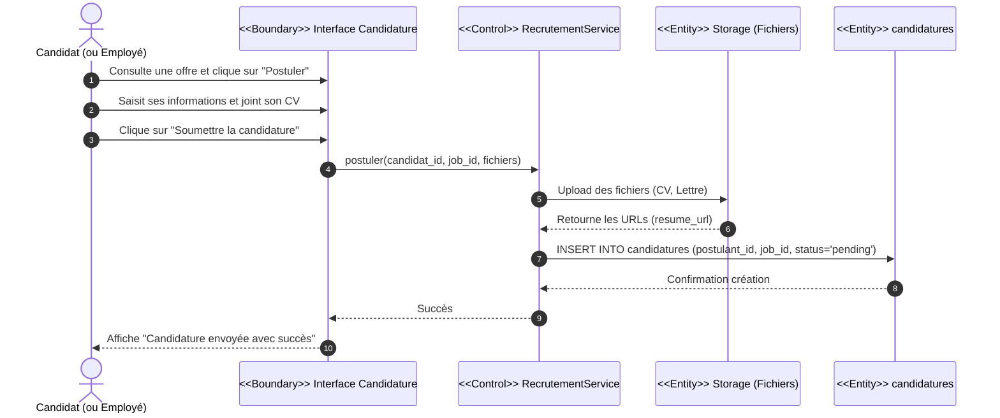
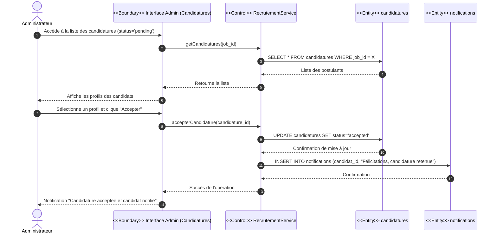

# Étude et réalisation du Sprint 3 : Recrutement & Acquisition

Dans cette section, nous présentons la conception UML dédiée au Sprint 3. Ce module marque l'ouverture de la plateforme vers l'extérieur (les candidats) tout en permettant la mobilité interne (les employés existants). Il gère le cycle de vie complet du recrutement, de la publication de l'offre jusqu'à l'embauche.

---

## 1. Diagramme des Cas d'Utilisation

Ce diagramme illustre les interactions possibles entre les différents acteurs (Administrateur, Candidat, Employé) et le module de recrutement.

```mermaid
usecaseDiagram
    actor "Candidat" as cand
    actor "Employé" as emp
    actor "Administrateur" as admin

    package "Module de Recrutement" {
        usecase "Consulter les offres d'emploi" as UC1
        usecase "Postuler à une offre (Upload CV/Lettre)" as UC2
        
        usecase "Gérer les offres d'emploi" as UC3
        usecase "Créer une offre" as UC3_1
        usecase "Modifier/Supprimer une offre" as UC3_2
        
        usecase "Gérer les candidatures" as UC4
        usecase "Accepter une candidature" as UC4_1
        usecase "Refuser une candidature" as UC4_2
    }

    %% Accès côté Postulants (Externes et Internes)
    cand --> UC1
    cand --> UC2
    emp --> UC1
    emp --> UC2
    
    %% Accès côté RH
    admin --> UC3
    admin --> UC4

    %% Inclusions pour la gestion des offres
    UC3 ..> UC3_1 : <<include>>
    UC3 ..> UC3_2 : <<include>>

    %% Inclusions pour la gestion des candidatures
    UC4 ..> UC4_1 : <<include>>
    UC4 ..> UC4_2 : <<include>>
```

**Description des Cas d'Utilisation :**
- **Consulter et Postuler :** Les candidats externes et les employés (mobilité interne) peuvent consulter les annonces actives et soumettre leur profil. La postulation exige obligatoirement le téléchargement des documents requis (CV, lettre de motivation).
- **Gérer les offres d'emploi :** L'administrateur RH a un contrôle total (CRUD) sur la publication des offres.
- **Gérer les candidatures :** L'administrateur RH filtre les postulants et décide de l'issue de chaque candidature (acceptation ou refus).

---

## 2. Diagramme de Classes (Intégration du Sprint 3)

Ce diagramme vient compléter la structure initiale en y greffant les entités liées au recrutement, reflétant fidèlement le schéma de la base de données (tables `jobs`, `postulant`, `candidatures`).



**Justification de la conception :**
- Le `Candidat` hérite d'`Utilisateur`, tout comme l'`Employé` et l'`Administrateur`. Cela garantit que le système d'authentification central (Sprint 1) fonctionne de manière uniforme pour tous.
- La classe d'association `Candidature` fait le lien parfait entre un `Candidat` (ou `Employe`) et une `OffreEmploi` (`jobs`), en stockant l'état (`status`) du recrutement.

---

## 3. Diagrammes de Séquences

Les processus de recrutement sont détaillés à l'aide de la notation BCE (Boundary, Control, Entity) pour séparer l'interface, la logique métier et la persistance des données.

### 3.1. Scénario : Publier une offre d'emploi

**Diagramme de séquence détaillé du cas d'utilisation « Créer une offre »**

Pour publier un nouveau besoin en recrutement, l'administrateur RH accède à l'interface de gestion des offres. Après avoir saisi les détails de l'annonce (titre, description, exigences, date limite), il soumet le formulaire. Le service de recrutement valide les informations saisies et exécute une requête d'insertion dans la base de données (table `jobs`). Une fois la création confirmée par la base, le système retourne une réponse de succès et affiche un message de confirmation à l'administrateur.



### 3.2. Scénario : Postuler à une offre d'emploi

**Diagramme de séquence détaillé du cas d'utilisation « Postuler à une offre »**

Le candidat, après avoir consulté une offre ouverte, clique sur le bouton pour postuler. Il remplit son profil et télécharge son CV et sa lettre de motivation. Ces fichiers sont d'abord envoyés au service de stockage (Storage). Une fois les URLs des fichiers obtenues, le service de recrutement insère une nouvelle ligne dans la table `candidatures` liant l'utilisateur à l'offre. Le candidat reçoit alors un message confirmant l'envoi de sa candidature.



### 3.3. Scénario : Traiter une candidature (Accepter)

**Diagramme de séquence détaillé du cas d'utilisation « Accepter une candidature »**

L'administrateur consulte la liste des candidatures en attente pour une offre spécifique. S'il décide de retenir un candidat, il clique sur "Accepter". Le système met immédiatement à jour le statut de la candidature à « Accepté » dans la table `candidatures`. Techniquement, ce processus déclenche également la transition du statut du candidat vers un futur employé, et une notification (In-App ou Email) est envoyée pour l'informer de sa réussite.


